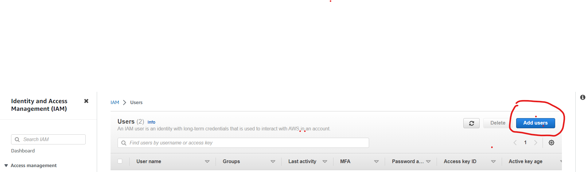

## AWS Multi-Factor Authentication for IAM Users ##

it is a best practice that is encouraged by AWS to assign or enable multi-factor authentication (MFA) for your AWS root account. MFA adds an extra layer of security by requiring users to provide a second form of authentication, such as a token or SMS message, in addition to their password.

In this project, we will be configuring MFA on a single user and secondly, writing an IAM policy that would enforce MFA across all users in an fiticious company.

## Project: Enable MFA on a single User ##

**1. Create an IAM User via the console**

After enabling the MFA for the root account and securig it. We will be configuring an IAM User
a. Login to your AWS account (you can create a free account on AWS on a free tier)

b. Go to the search bar and type IAM, you will be brought to the IAM Dashboard.

c. Click on User and Add users named TheHulk

d. We will be providing the user with AWS console access so check the "Provide user access to the AWS Management Console"

e. Click on Custom password and set the password as OceanParadise4923@.

f. Since this is just for practice. uncheck the "Users must create a new password at next sign-in"

g. Click Next

h. For the Permission Options, select "Attach policies directly" and select the "AdministratorAcess"

Lets take a look at the Administraor Access Policy

# Every policy must have a single statement or multiple statements
# Ef # *(wildcard) means all actions
# all resources

i. click next and "Create User"

j. Copy the Console sin-in URL of your new user and sign-in on an incognito window

I have logged into the new user AWS account and never asked for another factor for authentication, a second authentication means like a virtual MFA, Hubi keys is more secure.

In the search bar, search and navigate to IAM

a. Click on "add MFA" to start the process of enabling MFA on the new user

b. Click "Assign MFA"

b. Choose a device name and select either the Authenticator App, Security key or Hardware TOTP token. I'll be using the "Authenticator App" for this demo.

c. Then click next

d. Scan the QRcode and type in two MFA consecutive codes from your device

**You have successfully assigned MFA on the new IAM User**

