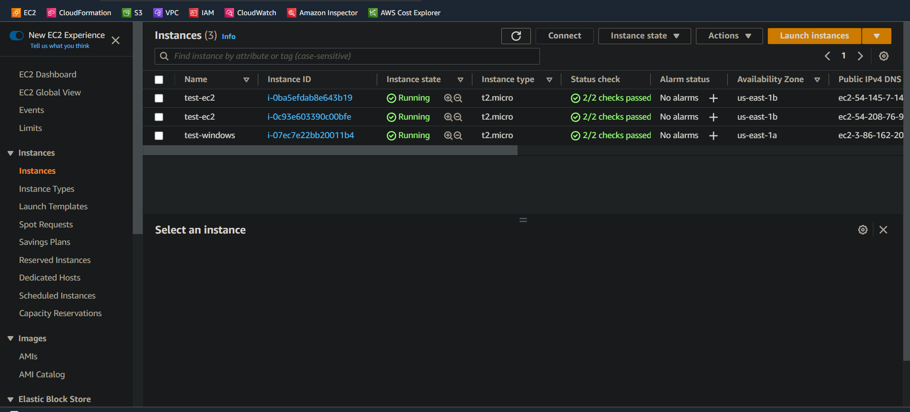

# What is Amazon Inspector: #

## Amazon Inspector: Description ##
It is an automated security assessment service that helps improve the security and complaince of applications deployed on AWS. Amazon Inspector automatically assesses applications for exposure, vulnerabilities, and deviations from best practices.

it is also designed to scan the EC2 instances and it's operating sysem as well as any container running inside the EC2 Instance and detect any deviation that can put the instance or any application running witin the instance at risk or going against cybersecurity best practices.

A list of best practices AWS Inspectors inspects includes:
**a. Center for Internet security (CIS) Benchmarks**

**b. Security best practices for Amzon Inspector**

## Prereguisites ##

+ An AWS Account with full admin privileges (much likely not root) because we will be deploying some AWS resources and setting up a IAM Role.

# Getting Started #
## A Brief step by step of the project using AWS Inspector ##

**1. Set up an Two (2) Ec2 Instance, one a Amazon Linux Instance and a Windows 2019 Instance.**

**2. Create an IAM Role that would be used by the EC2 Instance to communicate with System Manager** 

**3. Configure AWS Inspector, by creating an Inspector assessment target, which specifies the EC2 instance to be assessed.**

**3. Run the assessment: State an assessment run using the assessment template. Inspector will then run a series of tests on the EC2 Instance to identify vulnerabilities and deviations from security best practices.**

**4. Review assessment findings: Once the assessment is complte, review the findings generated by Inspector. Each findings includes a descrption of the issue. the severity of the issue, and recomendations for remediations.**

**5. Remediate issues: Prioritize and remediate the issues identified by Inspector, using the recommendations provided in the findings. Once the issues are resolved, you can rerun the assessment to confirm that the issues have been resolved.**

**6. Session Manager which is a part of Systems Manager can be used to connect to the Instance to perform any manual test as needed.** 

## Tear-down of Resources ##
It is advisable to tear-down any resource spawn up during the course of this tutorial to aviod any additional cost and also to bring your account to the state it was before we started deploying resources.

**Steps:**
1. Delete the IAM Role created 
2. Terminate the EC2 Instances deployed
3. Deactivate Amazon Inspector
